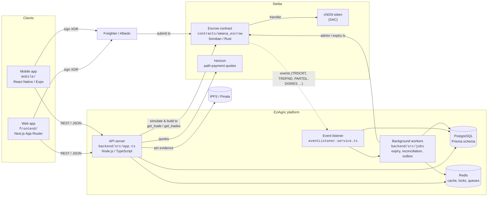

# Containers (C4 Level 2)

## Notes

- The contract is the source of truth for money; PostgreSQL holds a projection
  rebuilt from contract events (see [event flow](../event-flow.md)).
- Dashboards and the event listener read trades in pages via the batch getter
  `get_trades(ids)` (max 50 ids per call) instead of one `get_trade` per row.
- Path-payment funding (NGN → cNGN) is described in
  [ADR-001](../adr/ADR-001-stellar-path-payment-architecture.md).

Up: [System context](./system-context.md) · Down: [Contract modules](./contract-modules.md)
