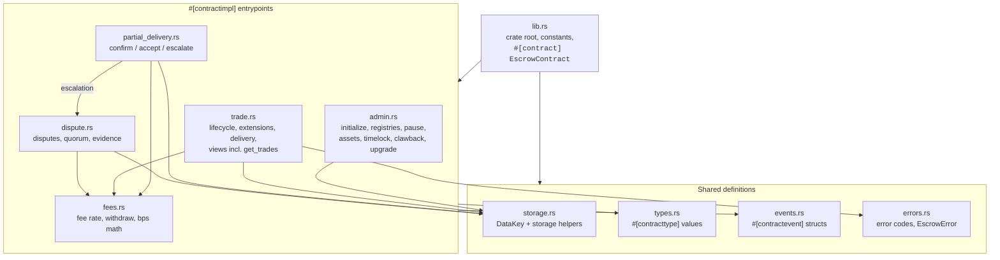

# Contract Modules

`contracts/amana_escrow/src` is split into cohesive modules. Each `*.rs`
module adds its own `#[contractimpl] impl EscrowContract` block; the exported
function set, storage keys and event topics are unchanged by the split.

The full module map lives in the
[contract overview](../eziagric_contract_overview.md#module-map).

Up: [Containers](./containers.md)
