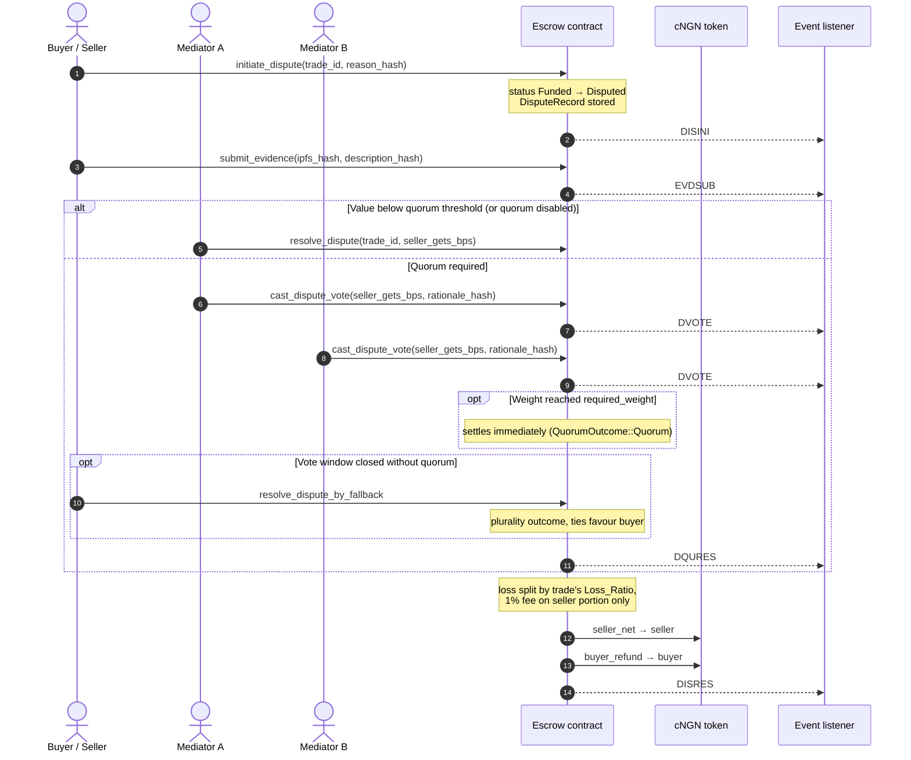

# Dispute Flow

Disputes are opened by either party (`initiate_dispute`) or by escalating an
unaccepted partial delivery (`escalate_partial_delivery`). Trades below the
quorum threshold are settled by one mediator; high-value trades need a
weighted mediator quorum.

Settlement math: [ADR-002](../adr/ADR-002-escrow-loss-sharing-model.md).
Quorum policy: [mediator quorum](../mediator-quorum.md).

See also: [Trade lifecycle](./trade-lifecycle.md).
