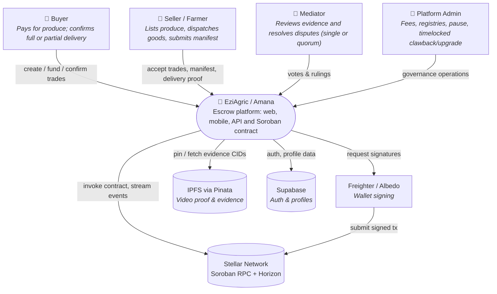

# System Context (C4 Level 1)

EziAgric ("Amana") is an escrow service for agricultural trades: buyer funds
are locked in a Soroban smart contract until delivery is confirmed, a dispute
is settled, or the trade is cancelled/expired.

## Trust boundaries

- **On-chain (authoritative):** escrowed balances, trade status, loss ratios,
  dispute outcomes, fee accrual. Enforced by `contracts/amana_escrow`.
- **Off-chain (derived / supporting):** user profiles, driver logs, evidence
  content, notifications, analytics. See
  [ADR-003](../adr/ADR-003-offchain-vs-onchain-data-partitioning.md).

Next level down: [Containers](./containers.md).
