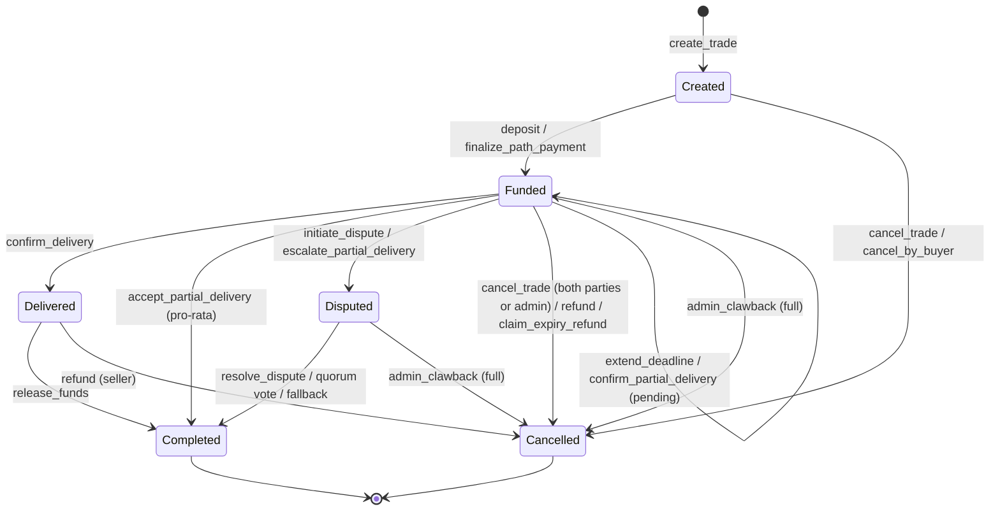
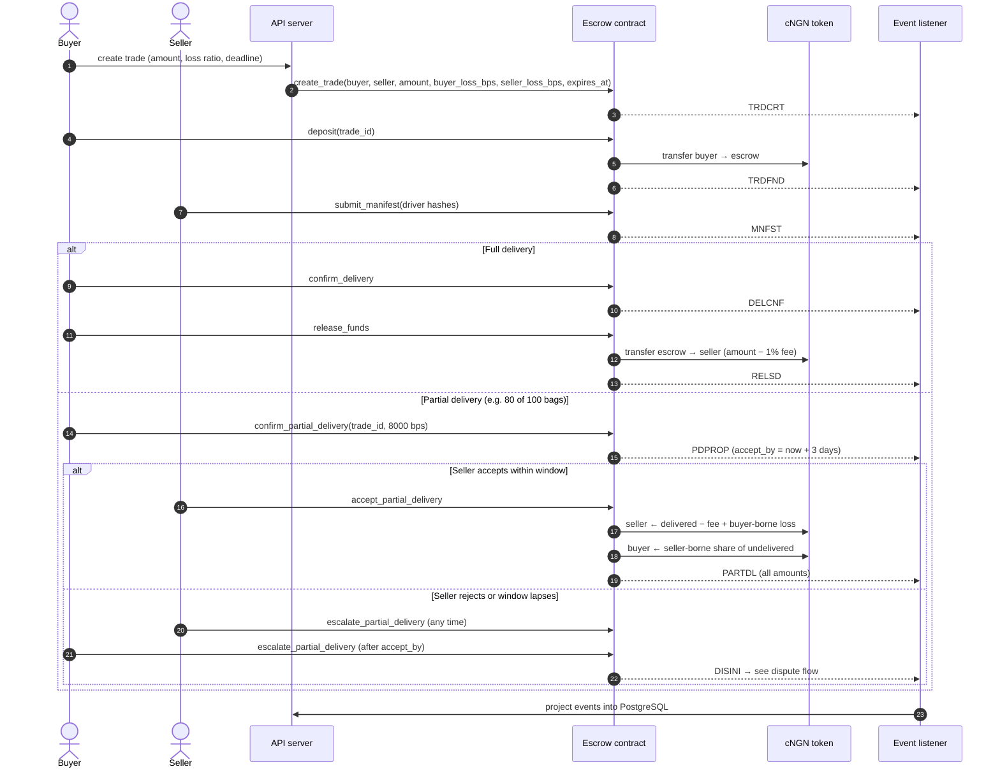

# Trade Lifecycle

## On-chain state machine

`TradeStatus` in `contracts/amana_escrow/src/types.rs`.

## Happy path and partial delivery

Money math for every branch is documented in
[the contract overview](../eziagric_contract_overview.md#partial-delivery) and
[ADR-002](../adr/ADR-002-escrow-loss-sharing-model.md).

See also: [Dispute flow](./dispute-flow.md).
